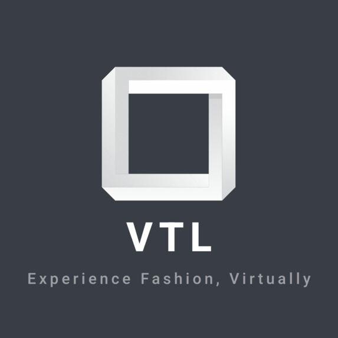
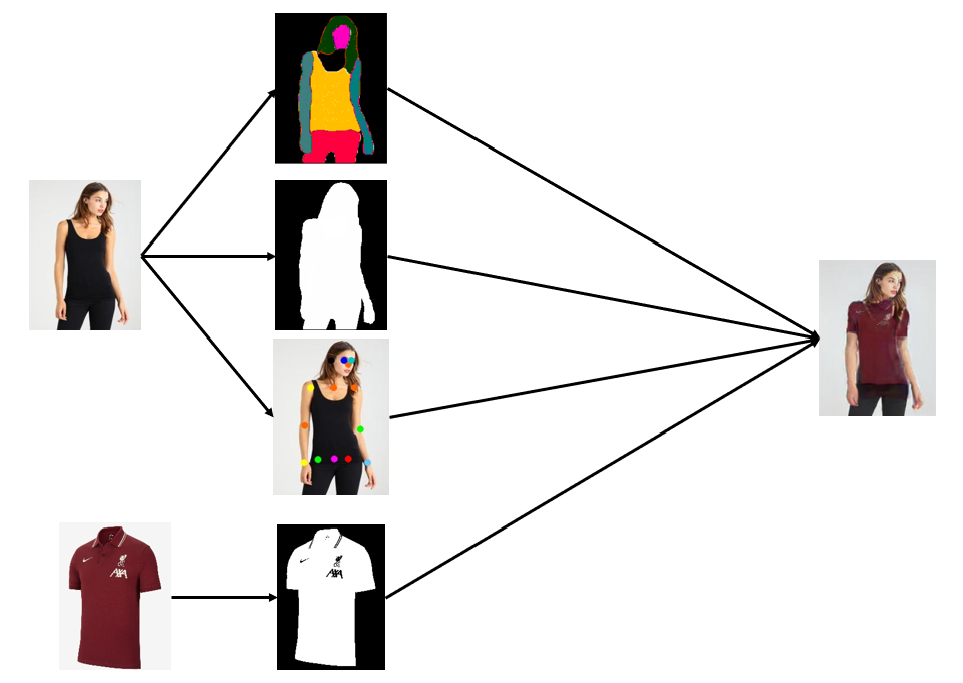

  

<h2 align="center">IndiansSolveClothing</h2>
<h2 align="center">Virtual Try-On Luxury</h2> 
<h2 align="center">Runners Up iNTUition v8.0</h2>

---
 

# Inspiration
Throughout the pandemic, virtual try on has become a topic of interest among everyone. Online shopping for clothes is very fascinating as we can find different products and brands from various sellers all of them in the same place. Choosing the appropriate designs, sizes, and fits may make or break a purchase. This brings the issue of trying on garments to light, as dressing rooms are the focal point of real-life shopping trips. With technology that can realistically clothe an individual virtually, can make re-creating the in-store experience online achievable. Our team was intrigued by this concept, so we created our own extension: ‘VTL', where you can virtually try on clothes and experience fashion at its best.

 

# What it does
Using our chrome extension VTL, users can select their favorite clothes and virtually try them on. VTL is really about the experience, and we believe that a better experience—one that provides a more realistic visualization of clothing—will boost buyer confidence, allowing them to make an appropriate fashion decision.

 

# How we built it
Our solution comprises of these major modules:

* Pose Generation using openpose

* Generate Mask of Clothes using OpenCV bitmasks

* Generate parsed image of user using a PSPNet model ( single-person human parsing) with a squeezenet backend architecture

* Generate Mask of person using OpenCV bitmasks and Pretrained squeezenet

* Used Generative Adversarial Networks to generate the image of user with wearing the clothing item

* Utilized a GMM (Geometric Matching Module) model to generate the warped clothes and warped cloth masks according to the target human and TOM (Try-On Module) model to blend the warped clothes from the GMM into the target human, to generate the final try-on output

* Created a Pipeline to sequentially process the user’s image and the cloth to try on and generate the final try-on image.
* Created a HTTP server with Flask to accept POST requests and send back the final try-on image

* Created a chrome extension for users to virtually try on any piece of clothing that they see online

 

# Demo

* [Youtube](https://www.youtube.com/watch?v=Mey5g_ULi2E)
 
* [Devpost](https://devpost.com/software/indianssolveclothing)

 

# What's next for VTL
* Extend the application to support multiple clothing types (trousers, masks, accessories, etc)

* Make a VR shopping store to give the users a more in-shop experience

* Improve robustness by checking for bad input images

 

# Team Members
* [Abhinav](https://github.com/ABHINAV112)

* [Aditya](https://github.com/Aditya239233)

* [Atul](https://github.com/Atul-Acharya-17)

* [Kartikeya](https://github.com/Kartikeya2001)

 

# References

* [Pose Estimation](https://github.com/CMU-Perceptual-Computing-Lab/openpose)
* [Single Human Parser](https://github.com/hyk1996/Single-Human-Parsing-LIP)
* [Try on Module (GMM and TOM networks)](https://github.com/minar09/cp-vton-plus)